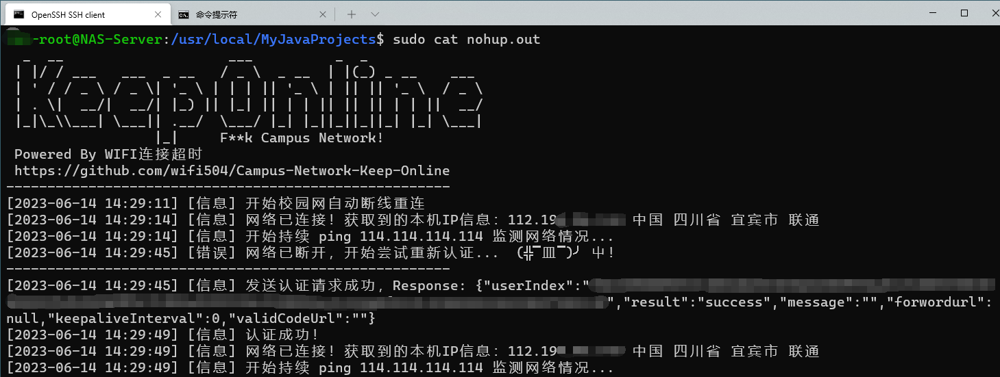
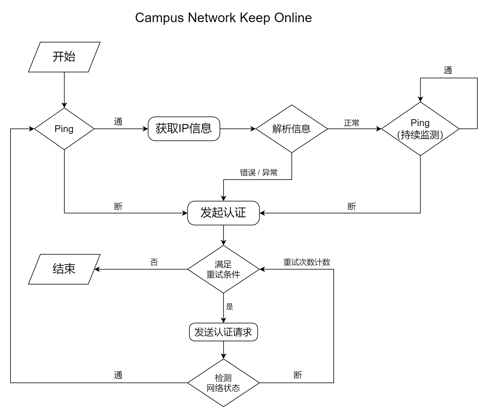
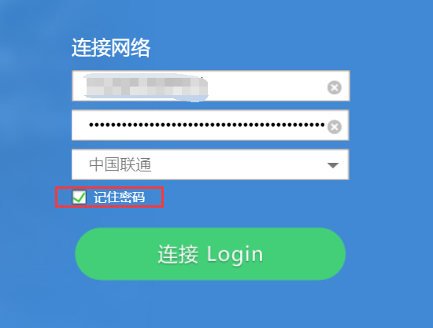
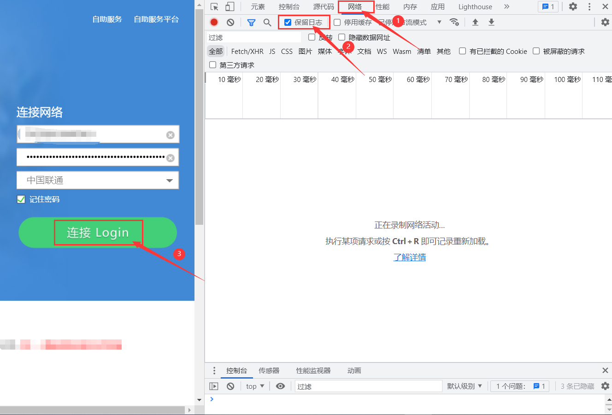
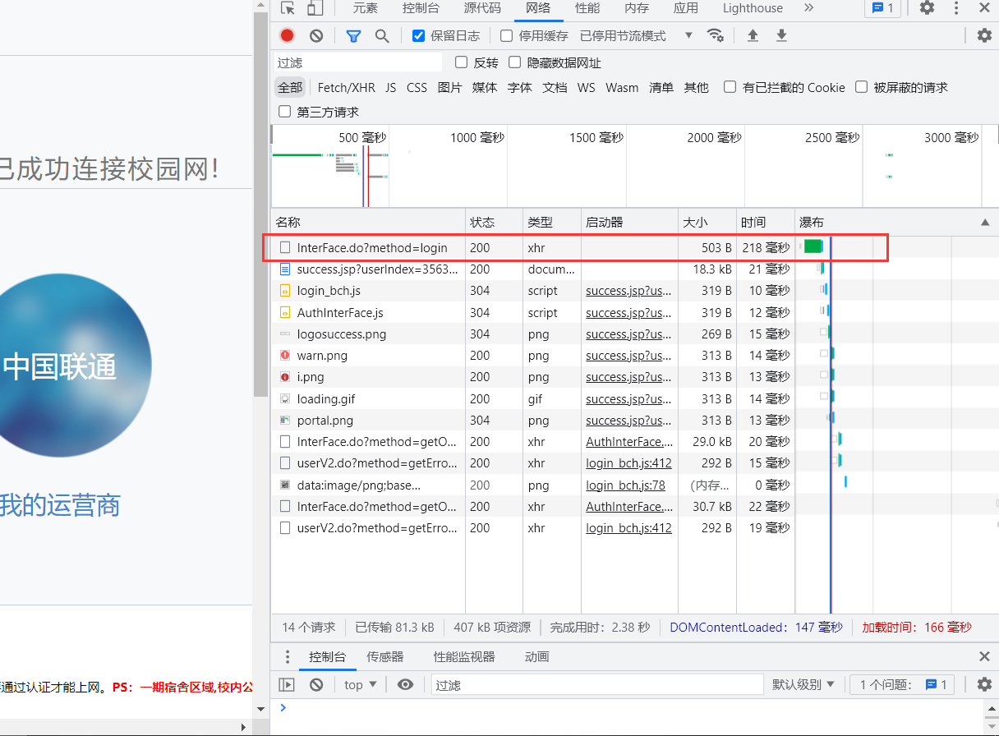
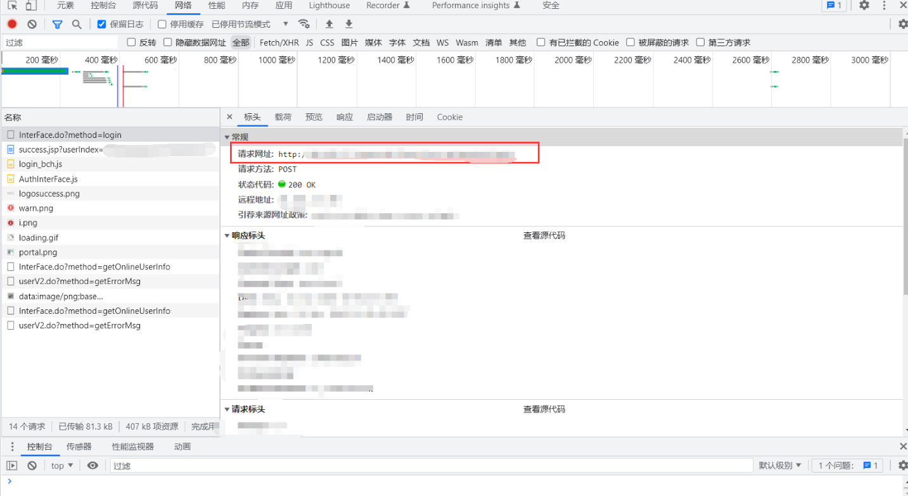
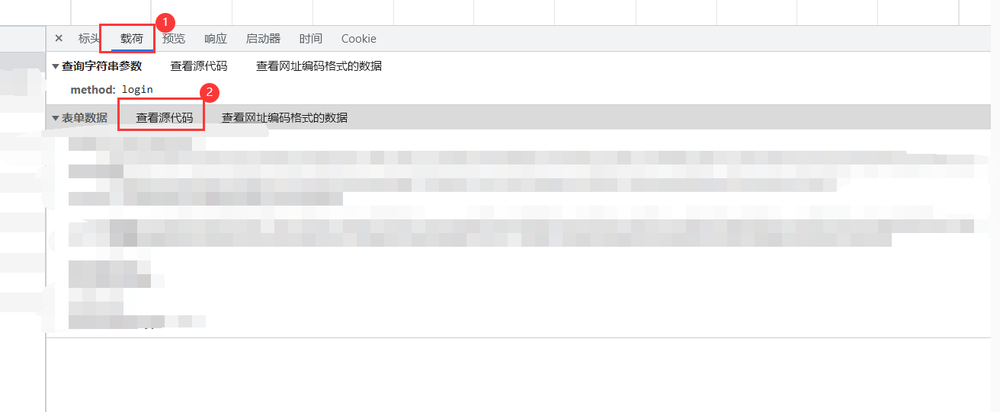
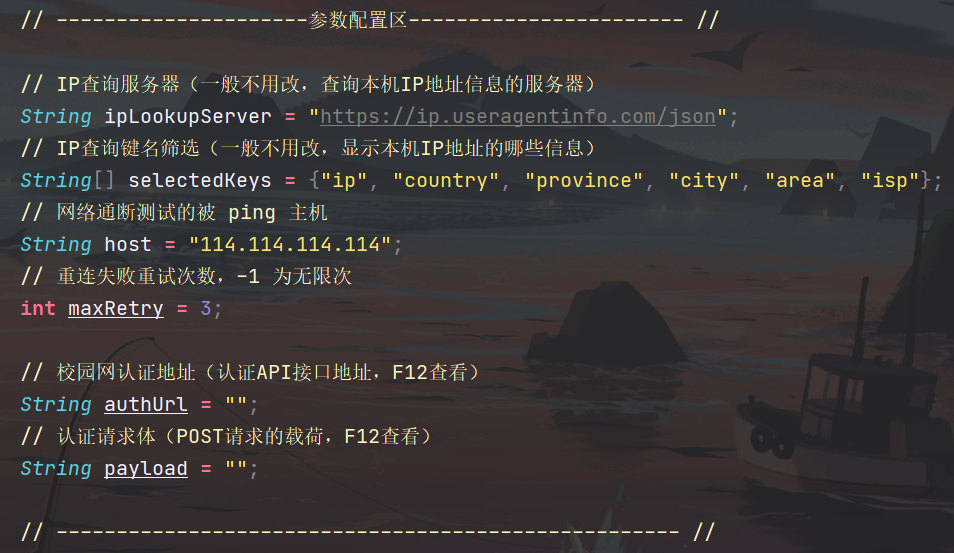

# Campus-Network-Keep-Online

使用 Java 实现的校园网自动断线重连程序

### 介绍

锐捷认证校园网的自动登录与断线重连

> 如果你学校的校园网登录界面长得一样，以及其他基于 `POST请求` 实现登录的校园网认证理论上都可使用


运行后效果如图




### 实现原理

如图所示，刚学 Java 没多久，堆了个奥里给出来，欢迎大佬们指点，欢迎提PR



### 使用方法

1. 登录你自己的校园网，输入正确的账号密码并选择正确的运营商，勾选记住密码

   

2. 按下键盘上 `F12` 打开浏览器开发人员工具，依次点击 网络、保留日志、连接

   

3. 找到以下请求，单击

   

4. 找到标头一列，复制好请求地址，存一下

   

5. 找到载荷一列，点击查看源代码，随后复制表单数据里面的全部内容，存一下，即现在我下面打码的部分

   

6. 按照以下格式把命令补充完整：

   ```bash
   java -jar -Dfile.encoding=UTF-8 Campus-Network-Keep-Online.jar <失败重试次数> <请求地址> <表单数据>
   ```

   示例：

   ```bash
   java -jar -Dfile.encoding=UTF-8 Campus-Network-Keep-Online.jar 10 http://10.10.10.10/login?abc=123 userID=123456……
   ```

7. 随后下载 [Releases](https://github.com/wifi504/Campus-Network-Keep-Online/releases) ，使用上面的命令运行即可

### 注意事项

1. 理论上所有基于 `POST请求` 实现登录认证的都可以使用，可以参考以上步骤获得相应的请求体

2. 您也可以直接在 [src/Main.java](src/Main.java) 修改以下内容，然后自行编译打包

   

   随后直接使用以下命令来启动程序

   ```bash
   java -jar -Dfile.encoding=UTF-8 Campus-Network-Keep-Online.jar
   ```

3. Java 是跨平台的兼容性极好的，你可以把这个程序运行在任何地方，包括但不限于Windows、Linux、Mac、Android……

   只需要你至少安装版本大于 1.8 （ Java8 ）的 JRE 或 JDK！

### 开源协议

[GPL-3.0 license](https://github.com/wifi504/Campus-Network-Keep-Online/blob/master/LICENSE)